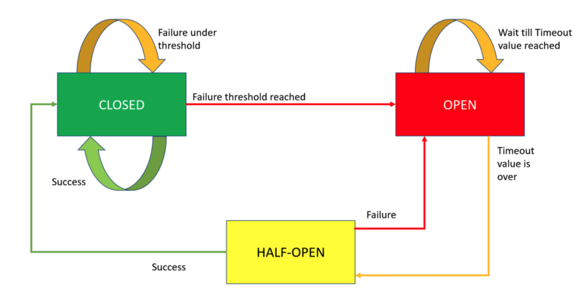

# circuitbreaker-spike

해당 패턴은 과전류로부터 전기 장비를 보호하도록 설계된 전기 스위치에서 영감을 얻었습니다.  

그리고 해당 패턴은 3가지 상태가 존재 한다.  

- Closed: 트래픽이 흐르는 것을 허용하는 상태
- Half Open: 현재 트래픽이 흐르는 상태이지만 상태를 이동(Closed or Open) 판단을 위한 중간 단계
- Open: 트래픽이 흐르는 것을 막는 상태

    

## 이유
- 빠른 실패와 행 걸리는 요청 방지
- Fallback 로직의 구현

## 구현 위치
- 외부 호출하기 전 위치

## 동작방식
특정 서비스가 실패하기 시작하고 우리가 설정 한 실패 임계 값을 초과하면 circuit breaker가 동작합니다. 이 경우 특정 서비스에 대한 요청 전송을 중지합니다. 이 경우 시스템이 복구 될 때까지 다른(fallback) 서비스를 사용할 수 있습니다.

## Package
- [opossum](https://www.npmjs.com/package/opossum)
- [pybreaker](https://github.com/danielfm/pybreaker)

## Reference
- [Circuit breaker pattern — What and why?](https://medium.com/bonniernewstech/circuit-breaker-pattern-what-and-why-a17f8babbec0)
- [Circuit Breaker Pattern](https://medium.com/@soumendrak/circuit-breaker-design-pattern-997c3521c1c4)
- [CircuitBreaker](https://martinfowler.com/bliki/CircuitBreaker.html)
